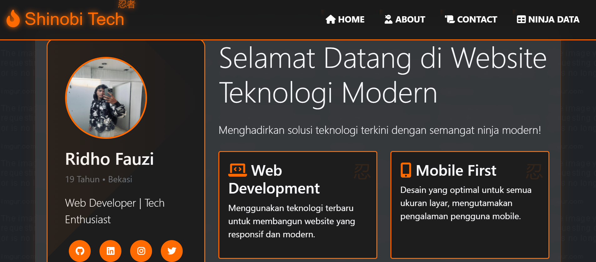
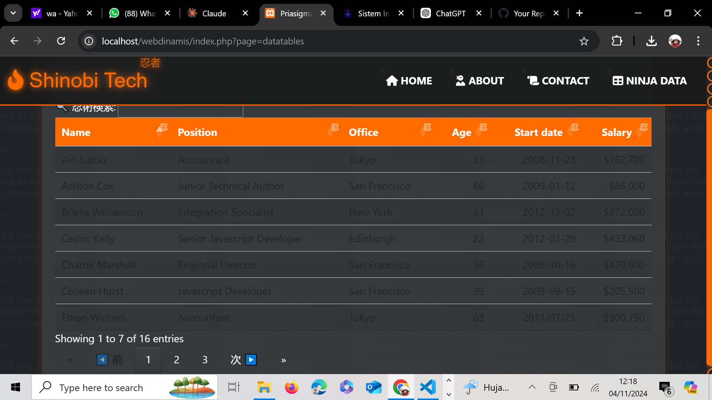
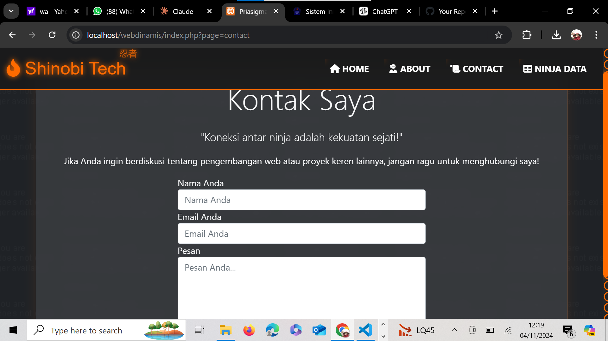

# Personal Website - Ridho Fauzi

Sebuah website personal modern dengan tema teknologi yang menampilkan profil, layanan, dan portofolio.

## 📑 Penjelasan Per-Page

### 🏠 Home (home.php)

└── Hero Section
    ├── Profile Card (Left Column)
    │   ├── Foto Profil (ridho.jpeg)
    │   ├── Nama dan Info Personal
    │   ├── Profesi
    │   └── Social Media Icons
    └── Content Section (Right Column)
        ├── Welcome Message
        └── Feature Cards
            ├── Web Development Card
            └── Mobile First Card

Halaman home menampilkan tampilan personal yang modern dengan kombinasi profile card dan feature cards. Menggunakan layout Bootstrap grid system dengan pembagian 4-8 columns untuk tampilan yang seimbang.

Fitur Utama Home:
- Profile card dengan foto dan social media links
- Responsive grid layout
- Feature cards dengan icons
- Modern typography dengan Bootstrap classes

### 📊 Datatables (datatables.php)

└── Data Table Section
    ├── Table Header
    │   └── Columns: Name, Position, Office, Age, Start date, Salary
    └── Table Body
        └── Sample Data Entries

Halaman datatables mengimplementasikan plugin DataTables.js untuk menampilkan data dalam format tabel yang interaktif dan responsif.

Fitur Utama Datatables:
- Sorting untuk setiap kolom
- Search functionality
- Pagination
- Responsive table layout
- Striped rows untuk readability
- Format data yang konsisten

### 📞 Contact (contact.php)

└── Contact Section
    ├── Header
    │   ├── Title
    │   └── Lead Text
    └── Contact Form
        ├── Input Fields
        │   ├── Nama
        │   ├── Email
        │   └── Pesan
        └── Submit Button

Halaman kontak menyediakan form interaktif untuk pengunjung dapat menghubungi pemilik website.

Fitur Utama Contact:
- Centered layout dengan offset
- Form validation
- Required field indicators
- Custom styling untuk form elements
- Responsive form layout
- POST method untuk pengiriman data

## 🎨 Styling & Theme

### Color Scheme
- Text Orange: Aksen untuk icons dan highlights
- Bootstrap Default Colors: Primary, Secondary
- Custom Text Colors: Muted untuk informasi tambahan

### Typography
- Display-4: Untuk headline utama
- Lead: Untuk subheadline
- Default Bootstrap typography untuk body text

### Layout
└── Page Structure
    ├── Bootstrap Container
    ├── Responsive Grid System
    └── Component-based Layout
        ├── Cards
        ├── Forms
        └── Tables

## 🛠 Teknologi yang Digunakan

### Frontend
- HTML5
- CSS3
- Bootstrap 5
  - Grid System
  - Components
  - Utilities
- Font Awesome 5 Icons
- JavaScript

### Plugins
- DataTables.js
  - Sorting functionality
  - Search functionality
  - Pagination support

## ✨ Fitur Teknis

- 🎨 Modern UI/UX Design
- 📱 Fully Responsive
- 🔍 Interactive DataTables
- 📝 Contact Form dengan Validasi
- 🔗 Social Media Integration
- 💼 Portfolio Showcase
- 🎯 Mobile-First Approach

## 🚀 Setup

1. Clone repository
git clone https://github.com/[username]/personal-website.git

2. Setup web server (Apache/Nginx)

3. Pastikan file ridho.jpeg ada di root directory

4. Konfigurasikan send_message.php untuk form kontak

## 📦 Dependencies

- Bootstrap 5.x
- Font Awesome 5.x
- DataTables.js
- jQuery (untuk DataTables)

## 💻 Browser Support

- Chrome (latest)
- Firefox (latest)
- Safari (latest)
- Edge (latest)

## 👤 Author

Ridho Fauzi
- 🌍 Lokasi: Bekasi
- 💼 Web Developer | Tech Enthusiast
- 🎯 Usia: 19 Tahun

## 📄 License

This project is licensed under the MIT License - see the LICENSE file for details